# Spotify Clone

This app is just a spotify clone.
[reference link](https://www.youtube.com/watch?v=4TFbXepOjLI&list=WL&index=3)

## Table of Contents

- [Features](#features)
- [Screenshots](#screenshots)
- [Videos](#videos)
- [Installation](#installation)
- [Packages used](#packages-used)

## Features

- Sign in/Sign up
- Get news songs
- Get songs in playlist
- Song player functionality

## Screenshots

  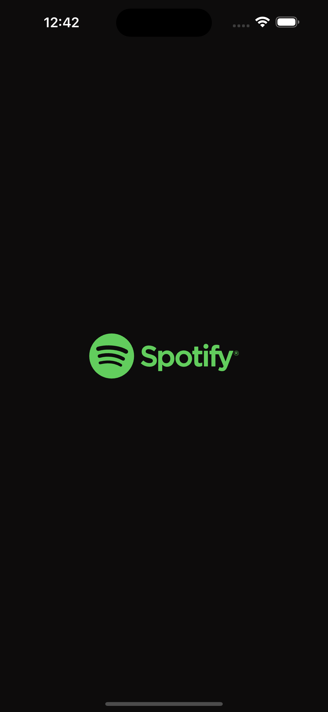
  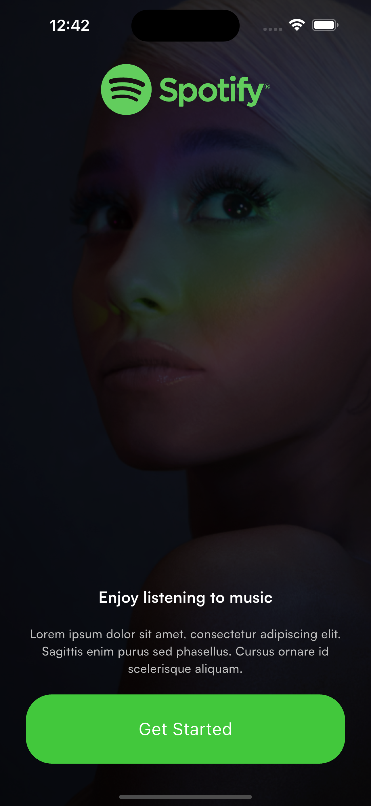
  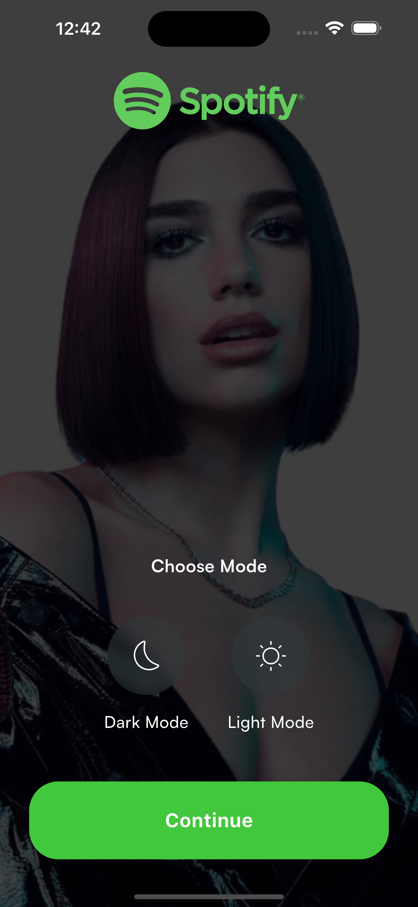

  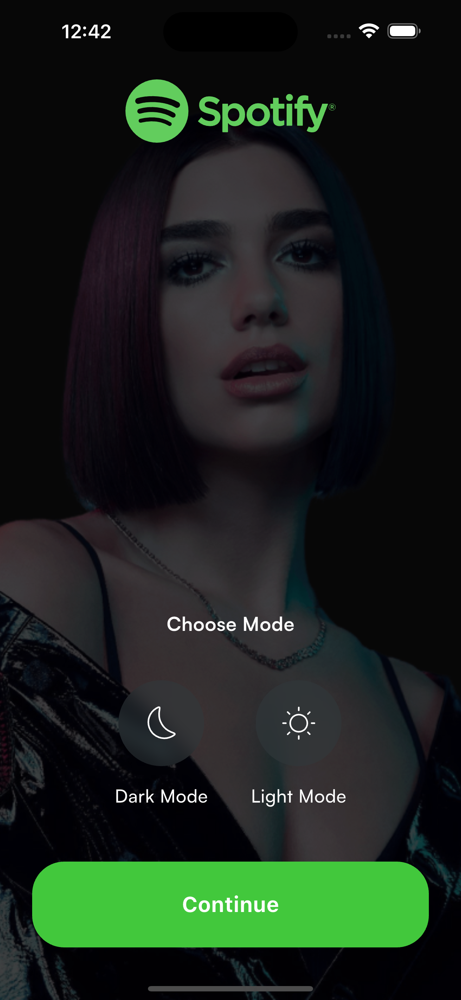
  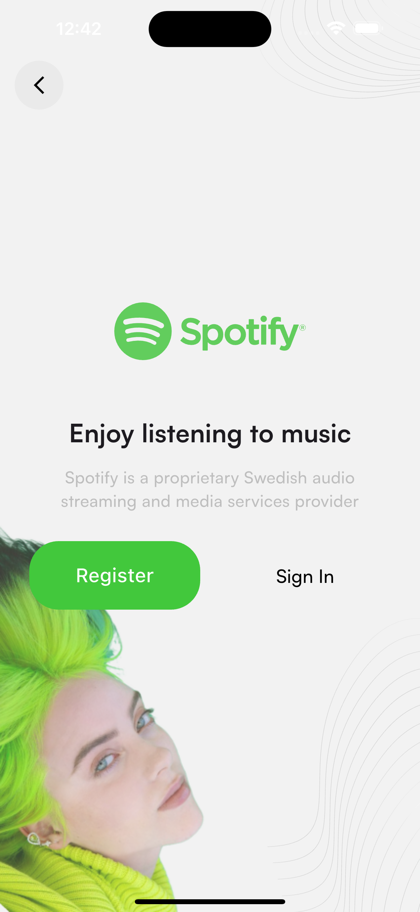
  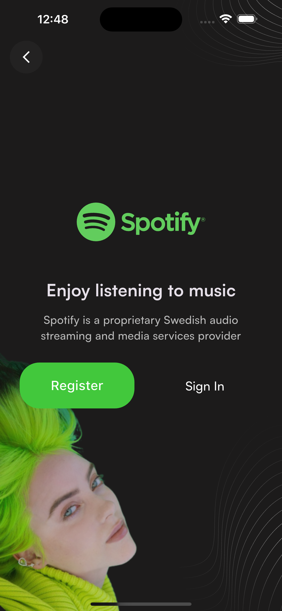

  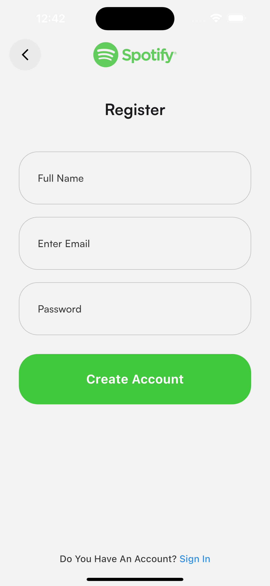
  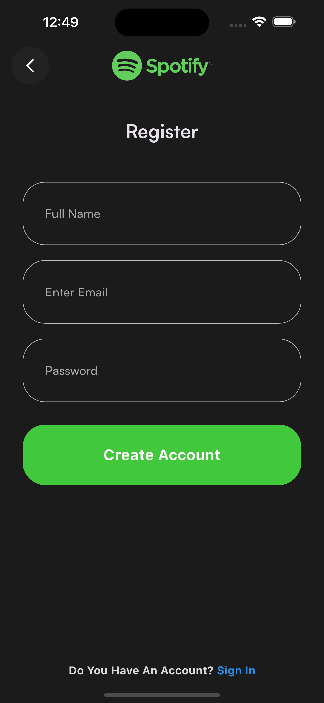
  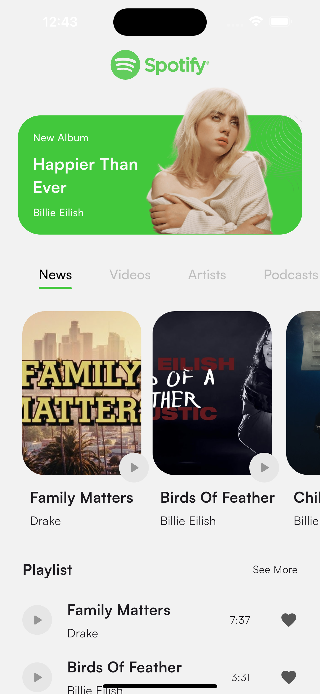

  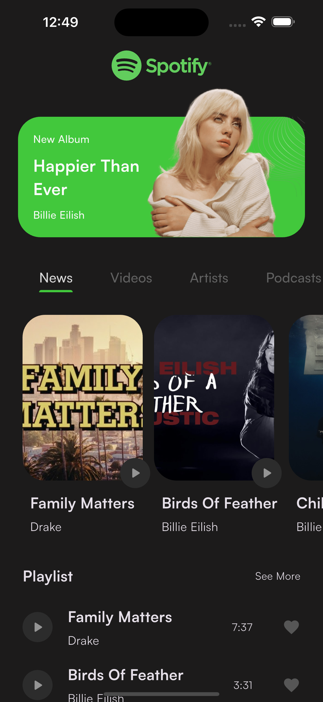
  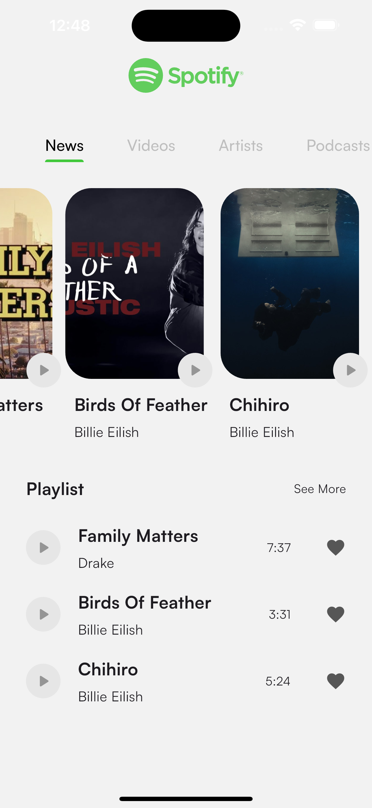
  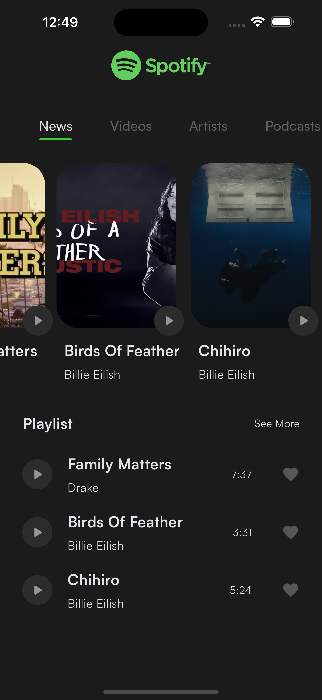

  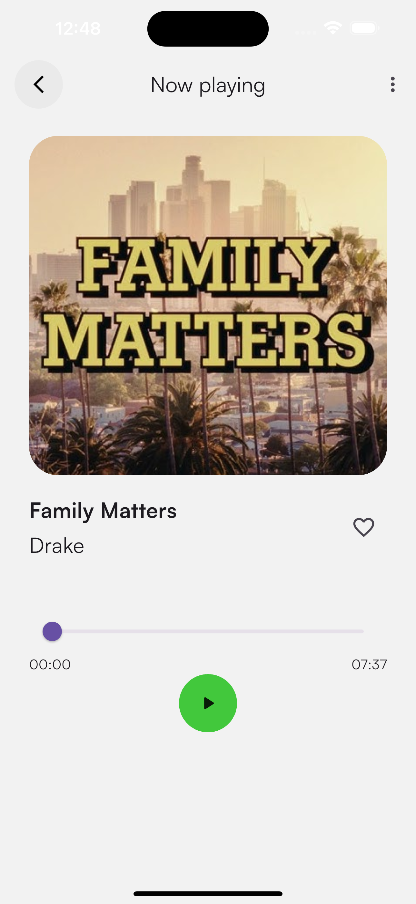
  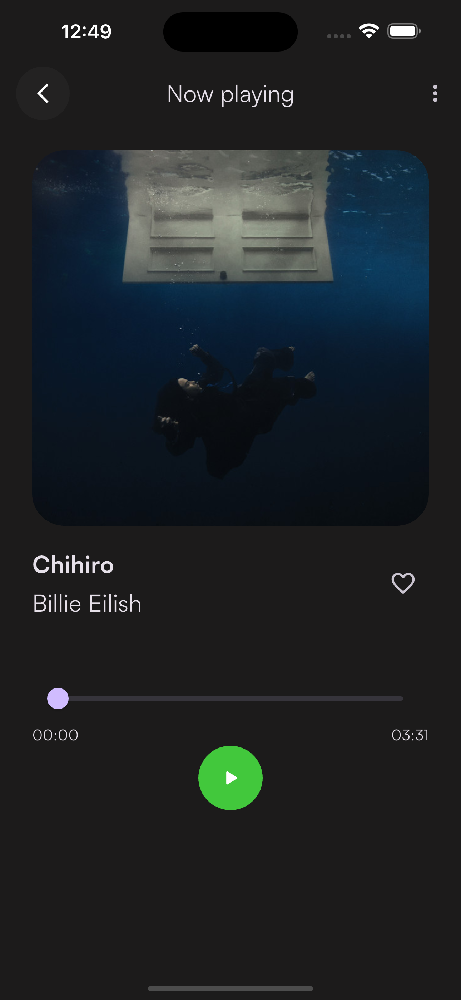
  

  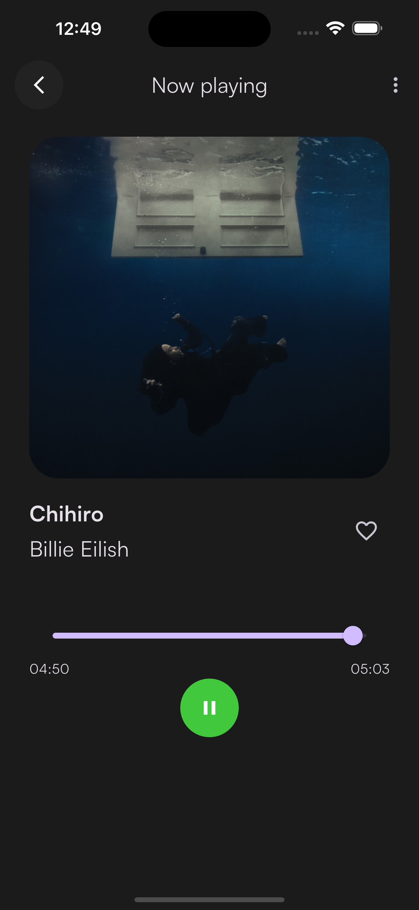

## Videos

[Video on YouTube](https://youtu.be/CDTkN01vKhM)

## Installation

After cloning this repository go to `spotify-clone` folder. Then, follow the following steps:

- Create project in [firebase](https://firebase.google.com)
- Connect your firebase into project
- On authentication feature turn on email/password in sign-in methods
- Turn on firebase firestorage
- Crate collection users
- (Model: uid(String), full_name(String), email(String), password(String))
- Crate collection songs
- (Model: title(String), artist(String), duration(number), release_date(Timestamp),
  cover_image_format(String): put format of the image in storage covers)
- Turn on storage
- Create folder covers
- Put images in this format '${Artist} ${Title} Cover.image_format'. Example: 'Billie Eilish Chihiro
  Cover.jpeg'. Pay attention to spaces
- Create folder songs
- Put songs in this format '${Artist} ${Title} Song.mp3'. Example: 'Billie Eilish Chihiro
  Song.mp3'. Pay attention to spaces

## Packages used

- flutter_svg
- bloc
- flutter_bloc
- hydrated_bloc
- path_provider
- firebase_core
- firebase_auth
- get_it
- cloud_firestore
- firebase_storage
- transparent_image
- just_audio
